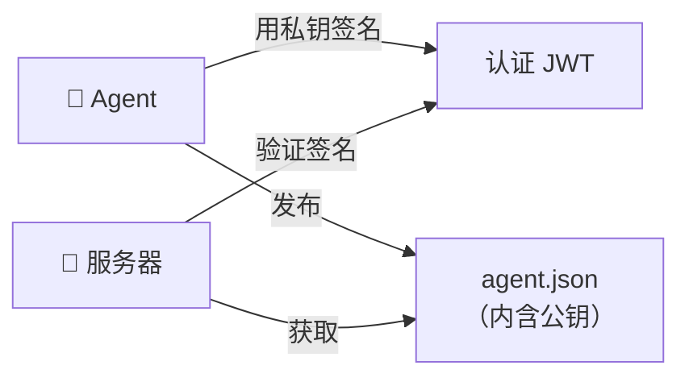
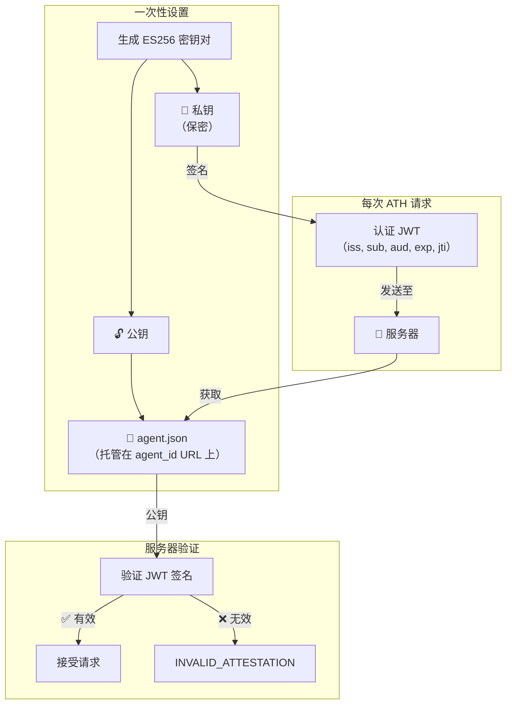

## 两个组成部分

每个 Agent 身份有两个组件：

| 组件 | 它是什么 | 在哪里 |
|------|---------|--------|
| **身份文档** | 包含 Agent 名称、开发者和公钥的 JSON 文件 | 发布在你控制的 URL 上 |
| **认证 JWT** | 签名的令牌，证明 Agent 拥有对应的私钥 | 随每个 ATH 请求发送 |



---

## 它们如何关联



## 身份文档

将此文件发布在你的 `agent_id` URL 上（如 `https://your-agent.com/.well-known/agent.json`）：

```json
{
  "ath_version": "0.1",
  "agent_id": "https://your-agent.com/.well-known/agent.json",
  "name": "My Agent",
  "developer": {
    "name": "Your Company",
    "id": "your-company",
    "contact": "security@yourcompany.com"
  },
  "capabilities": ["data-reading", "task-automation"],
  "public_key": {
    "kty": "EC",
    "crv": "P-256",
    "x": "...",
    "y": "..."
  }
}
```

`public_key` 是一个 JWK（JSON Web Key）。用以下方式生成：

```bash
# 生成密钥对
openssl ecparam -genkey -name prime256v1 -noout -out private.pem
# 将公钥导出为 JWK（使用 jose 库或在线转换器）
```

或者让 SDK 为你生成（参见演示的 `agent/server.ts`）。

---

## 认证 JWT

每次 Agent 调用 register、authorize 或 token 时，都会包含一个签名的 JWT：

```
Header:  { "alg": "ES256", "kid": "my-key-2024" }
Payload: {
  "iss": "https://your-agent.com",
  "sub": "https://your-agent.com/.well-known/agent.json",
  "aud": "https://service.example.com",   ← 你正在对话的对象
  "iat": 1714500000,                       ← 签署时间
  "exp": 1714503600,                       ← 过期时间
  "jti": "unique-random-id"               ← 防止重放
}
Signature: [用你的私钥签名]
```

**你不需要自己构建这个。** SDK 每次调用 `register()`、`authorize()` 或 `exchangeToken()` 时都会自动完成。

---

## 验证规则

服务器收到你的认证时会检查：

1. ✅ 签名匹配 `agent_id` 上的公钥
2. ✅ `aud` 匹配此服务器的 URL
3. ✅ `exp` 在未来
4. ✅ `iat` 在当前时间 5 分钟内（时钟偏差容忍）
5. ✅ `jti` 此前未出现过（防止重放）

如果任何检查失败 → `INVALID_ATTESTATION` 错误。

---

## 开发环境：跳过验证

演示使用 `skipAttestationVerification: true`，这样你无需发布真实的身份文档即可开发。SDK 仍然签署认证（格式是正确的），但服务器不验证签名。

**生产环境中请移除此配置。**
