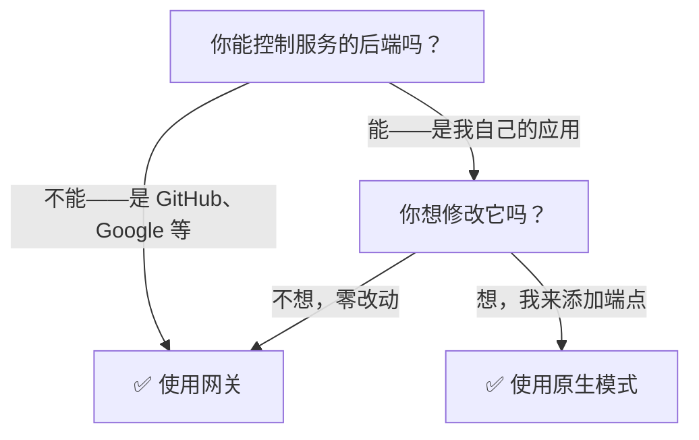

## 决策流程图

---

## 对比

| | 网关 | 原生 |
|-|------|------|
| **需要修改服务** | 不需要 | 需要添加 ATH 端点 |
| **Agent 如何发现** | `GET /.well-known/ath.json` | `GET /.well-known/ath-app.json` |
| **Agent 如何调用 API** | `proxy("github", "GET", "/user")` | `api("GET", "/products")` |
| **URL 模式** | `/ath/proxy/{provider}/{path}` | `{api_base}/{path}` |
| **谁持有上游令牌** | 网关 | 服务本身 |
| **多提供商** | 支持（一个网关，多个服务） | 每个服务单独集成 |
| **最适合** | 现有服务、快速设置 | 新服务、最大控制 |

---

## 何时使用网关

- 你想让 Agent 访问 **GitHub、Google、Slack 等**而这些服务无需知情
- 你想**集中管控**哪些 Agent 可以访问哪些服务
- 你是**平台团队**，管理多个 Agent 的访问

## 何时使用原生模式

- 你正在构建一个**新服务**，专为 Agent 访问而设计
- 你想要**自定义授权界面**（你自己的授权页面，而非网关的）
- 你想**完全掌控整个流程**——注册策略、令牌签发，所有的一切
- 你就是演示中的那个商店

---

## 可以同时使用两者吗？

可以！演示展示了同一个商店的两种模式：
- **原生模式：** Agent 直接连接服务（如 `https://your-app.com`）
- **网关模式：** Agent 连接网关（如 `https://your-gateway.com`），网关代理转发到服务

在两种情况下，商店的 API 代码完全相同——区别在于 ATH 层的位置。
