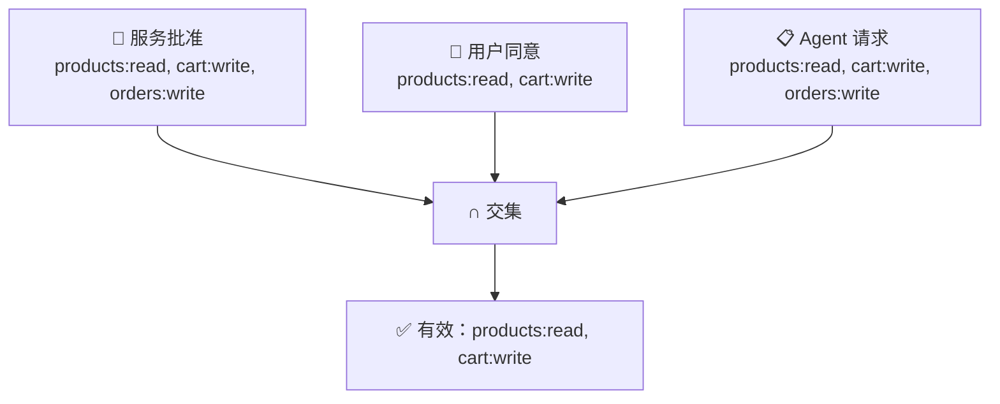
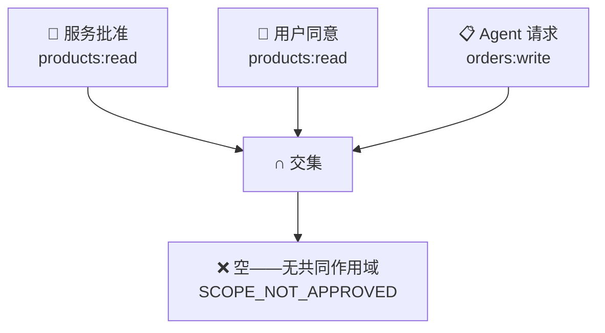

## 规则

当 Agent 获得令牌时，其有效权限是三个集合的**交集**：

```
有效权限 = 服务批准 ∩ 用户同意 ∩ Agent 请求
```



在这个例子中，Agent 请求了 `orders:write`，但用户只同意了 `products:read` 和 `cart:write`。因此有效令牌**不包含** `orders:write`。

---

## 为什么是三个集合？

| 集合 | 谁控制 | 含义 |
|------|:------:|------|
| **服务批准** | 服务运营者 | "我已审核这个 Agent。允许它使用这些功能。" |
| **用户同意** | 最终用户 | "我信任这个 Agent 用这些特定权限操作我的数据。" |
| **Agent 请求** | Agent（每次请求） | "对于这个任务，我只需要这些作用域。" |

这意味着：
- 恶意 Agent 无法获得服务未批准的作用域
- 用户不会被欺骗授予超出服务允许的权限
- Agent 可以请求**少于**其最大权限（最小权限原则）

---

## 交集为空时会怎样？

令牌签发**失败**。Agent 会收到 `SCOPE_NOT_APPROVED` 错误。



Agent 请求了 `orders:write`，但只被批准了 `products:read`。没有交集 → 没有令牌。

---

## 在令牌响应中

作用域交集会被明确返回，让你看到发生了什么：

```json
{
  "access_token": "ath_tk_...",
  "effective_scopes": ["products:read", "cart:write"],
  "scope_intersection": {
    "agent_approved": ["products:read", "cart:write", "orders:write"],
    "user_consented": ["products:read", "cart:write"],
    "effective": ["products:read", "cart:write"]
  }
}
```
