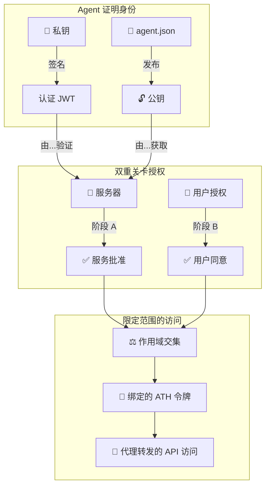

## 信任链



## ATH 能防范什么

| 威胁 | ATH 如何防范 |
|------|------------|
| Agent 未经服务许可访问服务 | 阶段 A——需要注册 + 批准 |
| Agent 未经用户同意行事 | 阶段 B——用户必须在浏览器中批准 |
| Agent 获得超出批准的作用域 | 作用域交集（三方最小值） |
| 被盗的 ATH 令牌被不同 Agent 使用 | 令牌绑定到 `agent_id` |
| 被盗的 ATH 令牌用于不同提供商 | 令牌绑定到 `provider_id` |
| 重放认证 JWT | `jti` 唯一性检查 |
| 过期的认证 JWT | `iat` 必须在 5 分钟内 |
| 令牌永不过期 | `expires_in`（默认 1 小时） |
| Agent 看到上游 OAuth 令牌 | 网关在服务器端持有；Agent 只获得不透明的 ATH 令牌 |

---

## 你必须做对的事

### 必需的（没有这些协议会失效）

- [ ] **生产环境使用 HTTPS** ——ATH 要求 TLS 1.2+
- [ ] **所有 OAuth URL 使用 PKCE** ——SDK 自动处理
- [ ] **验证认证** ——生产环境启用签名验证
- [ ] **检查 jti 防重放** ——使用内置的 `InMemoryJtiCache` 或 Redis
- [ ] **令牌过期** ——强制执行 `expires_in`

### 推荐的（显著提升安全性）

- [ ] **持久化密钥存储** ——生产环境不要使用临时密钥
- [ ] **审计日志** ——记录所有注册、授权和代理转发调用
- [ ] **速率限制** ——防止对注册和令牌端点的暴力攻击
- [ ] **作用域到路由的映射** ——不要让 `products:read` 访问订单端点
- [ ] **加密存储的提供商令牌** ——它们是敏感的 OAuth 凭据

---

## `skipAttestationVerification` 标志

你会在演示中看到：

```typescript
config: {
  skipAttestationVerification: true, // ⚠️ 仅限开发环境
}
```

这会禁用密码学身份验证。意味着：
- 任何作为 `agent_attestation` 传递的字符串都会被接受
- 服务器不会获取 Agent 的公钥
- 服务器不会验证 JWT 签名

**仅在本地开发中使用。** 生产环境请移除——SDK 能正确处理签名，因此一旦你发布了包含公钥的真实身份文档，一切就会"正常工作"。
