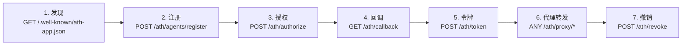

## 协议流程

端点按以下顺序调用：



## 端点列表

| 方法 | 路径 | 用途 |
|------|------|------|
| `GET` | `/.well-known/ath-app.json` | 原生服务发现 |
| `GET` | `/.well-known/ath.json` | 网关发现 |
| `POST` | `/ath/agents/register` | Agent 注册 |
| `POST` | `/ath/authorize` | 启动用户授权 |
| `GET` | `/ath/callback` | OAuth 回调 |
| `POST` | `/ath/token` | 令牌交换 |
| `ANY` | `/ath/proxy/{provider_id}/{path}` | API 代理转发 |
| `POST` | `/ath/revoke` | 令牌撤销 |

---

## POST /ath/agents/register

**请求：**
```json
{
  "agent_id": "https://agent.example/.well-known/agent.json",
  "agent_attestation": "<JWT>",
  "developer": { "name": "...", "id": "..." },
  "requested_providers": [{ "provider_id": "...", "scopes": ["..."] }],
  "purpose": "...",
  "redirect_uris": ["..."]
}
```

**响应 (201)：**
```json
{
  "client_id": "ath_...",
  "client_secret": "ath_secret_...",
  "agent_status": "approved",
  "approved_providers": [{ "provider_id": "...", "approved_scopes": [...], "denied_scopes": [...] }],
  "approval_expires": "2025-..."
}
```

---

## POST /ath/authorize

**请求：**
```json
{
  "client_id": "ath_...",
  "agent_attestation": "<JWT>",
  "provider_id": "...",
  "scopes": ["..."],
  "state": "<random>",
  "user_redirect_uri": "...",
  "resource": "..."
}
```

**响应 (200)：**
```json
{
  "authorization_url": "https://...",
  "ath_session_id": "ath_sess_..."
}
```

---

## POST /ath/token

**请求：**
```json
{
  "grant_type": "authorization_code",
  "client_id": "ath_...",
  "client_secret": "ath_secret_...",
  "agent_attestation": "<JWT with aud=token endpoint URL>",
  "code": "...",
  "ath_session_id": "ath_sess_..."
}
```

**响应 (200)：**
```json
{
  "access_token": "ath_tk_...",
  "token_type": "Bearer",
  "expires_in": 3600,
  "effective_scopes": ["..."],
  "provider_id": "...",
  "agent_id": "...",
  "scope_intersection": {
    "agent_approved": ["..."],
    "user_consented": ["..."],
    "effective": ["..."]
  }
}
```

---

## ANY /ath/proxy/{provider_id}/{path}

**请求头：**
```
Authorization: Bearer ath_tk_...
X-ATH-Agent-ID: https://agent.example/.well-known/agent.json  (可选)
```

**响应：** 上游 API 响应（直接转发）。

---

## POST /ath/revoke

**请求：**
```json
{
  "token": "ath_tk_...",
  "client_id": "ath_...",
  "client_secret": "ath_secret_..."
}
```

**响应：** 始终返回 `200 OK`。
