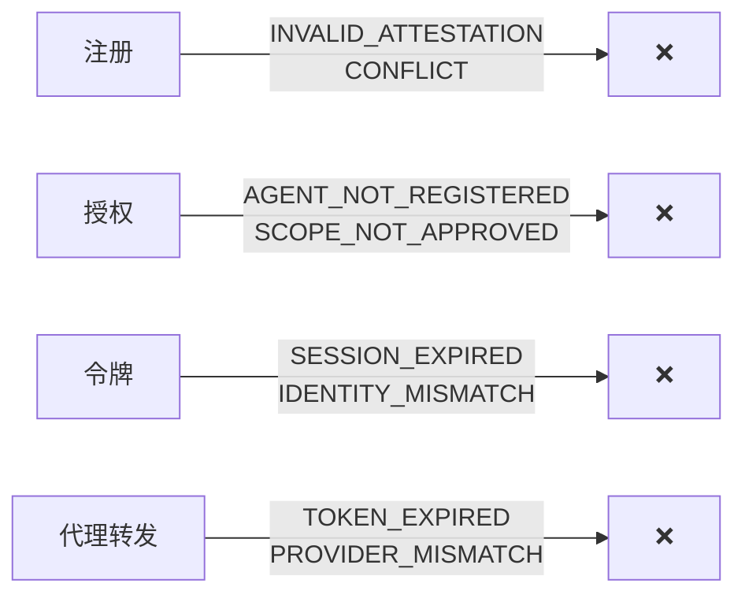

## 错误发生在哪里



大多数错误从错误码本身就能理解。下表将每个错误映射到其原因和修复方法。

## 错误响应格式

```json
{
  "code": "ERROR_CODE",
  "message": "可读的描述信息"
}
```

---

## 错误码参考

| 错误码 | HTTP | 问题描述 | 修复方法 |
|--------|:----:|---------|---------|
| `INVALID_ATTESTATION` | 401 | JWT 格式错误、已过期、`aud` 错误或 `jti` 被重放 | 生成新的认证。检查 `aud` 是否匹配端点 URL。 |
| `AGENT_NOT_REGISTERED` | 403 | Agent 尚未注册 | 先调用 `/ath/agents/register` |
| `AGENT_UNAPPROVED` | 403 | 注册状态为 `pending` 或 `denied` | 等待批准或使用不同的作用域重新请求 |
| `PROVIDER_NOT_APPROVED` | 403 | Agent 未被批准访问此提供商 | 向此提供商注册 |
| `SCOPE_NOT_APPROVED` | 403 | 请求的作用域超出已批准范围 | 只请求你已被批准的作用域 |
| `SESSION_NOT_FOUND` | 400 | 未知的 `ath_session_id` | 使用最近 `authorize` 调用返回的会话 |
| `SESSION_EXPIRED` | 400 | 会话超过 10 分钟 | 重新调用 `authorize`——会话是短期的 |
| `STATE_MISMATCH` | 400 | OAuth state 不匹配 | 不要重复使用 state 值 |
| `TOKEN_INVALID` | 401 | 令牌未被识别 | 获取新令牌 |
| `TOKEN_EXPIRED` | 401 | 令牌已超过 `expires_in` | 重新授权并获取新令牌 |
| `TOKEN_REVOKED` | 401 | 令牌已被撤销 | 重新授权并获取新令牌 |
| `AGENT_IDENTITY_MISMATCH` | 403 | 认证的 `sub` ≠ 已注册的 Agent | 检查你的 `agentId` 是否与注册时一致 |
| `PROVIDER_MISMATCH` | 403 | 令牌是为不同提供商签发的 | 只在签发令牌的提供商上使用该令牌 |
| `USER_DENIED` | 403 | 用户在授权页面点击了"拒绝" | 用户拒绝了——请尊重他们的决定 |
| `OAUTH_ERROR` | 502 | 上游 OAuth 提供商返回错误 | 检查提供商配置 |
| `INTERNAL_ERROR` | 500 | 服务器 Bug | 向服务运营者报告 |

---

## 常见错误

<Accordion title="在 /ath/token 上出现 INVALID_ATTESTATION">
令牌端点的认证 JWT 的 `aud` 必须设为**完整的令牌端点 URL**（如 `https://example.com/ath/token`），而非基础 URL。SDK 会自动处理——如果你使用 SDK 仍遇到此错误，请检查 `url` 配置是否正确。
</Accordion>

<Accordion title="用户批准后出现 SESSION_EXPIRED">
ATH 会话在 10 分钟后过期。如果用户花了太长时间批准（或你在他们批准后等了太久），会话就会过期。重新调用 `authorize` 获取新会话。
</Accordion>

<Accordion title="代理转发时出现 PROVIDER_MISMATCH">
每个 ATH 令牌绑定到一个提供商。如果你获得了 `github` 的令牌并尝试用于 `slack`，就会遇到此错误。为每个提供商单独获取令牌。
</Accordion>
