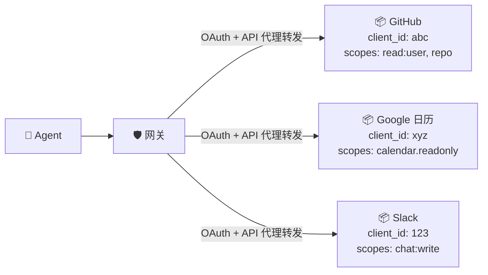

## 提供商如何连接

每个提供商都是一个受 OAuth 保护的服务，网关可以代理访问：



对于每个提供商，你需要在该提供商处注册一个 OAuth 应用（获取 `client_id` 和 `client_secret`），然后添加到网关的 `providers.json` 中。

## providers.json 格式

每个提供商需要 6 个字段：

```json
{
  "provider-id": {
    "display_name": "可读名称",
    "available_scopes": ["scope1", "scope2"],
    "authorize_endpoint": "https://provider.com/oauth/authorize",
    "token_endpoint": "https://provider.com/oauth/token",
    "api_base_url": "https://api.provider.com",
    "client_id": "your-oauth-client-id",
    "client_secret": "your-oauth-client-secret"
  }
}
```

`provider-id` 是 Agent 在请求中使用的标识（如 `athx proxy github GET /user`）。

---

## GitHub

1. 前往 [GitHub → Settings → Developer settings → OAuth Apps → New](https://github.com/settings/developers)
2. 将 **Authorization callback URL** 设为 `https://your-gateway.com/ath/callback`

```json
{
  "github": {
    "display_name": "GitHub",
    "available_scopes": ["read:user", "repo", "gist", "read:org"],
    "authorize_endpoint": "https://github.com/login/oauth/authorize",
    "token_endpoint": "https://github.com/login/oauth/access_token",
    "api_base_url": "https://api.github.com",
    "client_id": "Iv1.abc123",
    "client_secret": "secret_xyz"
  }
}
```

**测试：** `athx proxy github GET /user`

---

## Google（日历、Gmail 等）

1. 前往 [Google Cloud Console → APIs & Services → Credentials](https://console.cloud.google.com/apis/credentials)
2. 创建 **OAuth 2.0 Client ID** → Web application
3. 添加重定向 URI：`https://your-gateway.com/ath/callback`
4. 启用所需的 API（Calendar API、Gmail API 等）

```json
{
  "google-calendar": {
    "display_name": "Google Calendar",
    "available_scopes": [
      "https://www.googleapis.com/auth/calendar.readonly",
      "https://www.googleapis.com/auth/calendar.events"
    ],
    "authorize_endpoint": "https://accounts.google.com/o/oauth2/v2/auth",
    "token_endpoint": "https://oauth2.googleapis.com/token",
    "api_base_url": "https://www.googleapis.com/calendar/v3",
    "client_id": "123456.apps.googleusercontent.com",
    "client_secret": "GOCSPX-secret"
  }
}
```

**测试：** `athx proxy google-calendar GET /calendars/primary/events`

---

## Slack

1. 前往 [api.slack.com/apps](https://api.slack.com/apps) → 创建新应用
2. 在 **OAuth & Permissions** 下，添加重定向 URL：`https://your-gateway.com/ath/callback`

```json
{
  "slack": {
    "display_name": "Slack",
    "available_scopes": ["channels:read", "chat:write", "users:read"],
    "authorize_endpoint": "https://slack.com/oauth/v2/authorize",
    "token_endpoint": "https://slack.com/api/oauth.v2.access",
    "api_base_url": "https://slack.com/api",
    "client_id": "123.456",
    "client_secret": "abc123"
  }
}
```

---

## 任何 OAuth 2.0 提供商

如果服务支持标准 OAuth 2.0 Authorization Code 流程：

```json
{
  "my-service": {
    "display_name": "我的内部服务",
    "available_scopes": ["read", "write"],
    "authorize_endpoint": "https://my-service.com/oauth/authorize",
    "token_endpoint": "https://my-service.com/oauth/token",
    "api_base_url": "https://api.my-service.com/v1",
    "client_id": "client-id",
    "client_secret": "client-secret"
  }
}
```

**要求：** 提供商必须支持 Authorization Code 授权方式。推荐支持 PKCE，但网关自己会处理 PKCE 挑战。

---

## 多个提供商

直接全部添加到同一个 `providers.json` 中：

```json
{
  "github": { ... },
  "google-calendar": { ... },
  "slack": { ... }
}
```

Agent 可以发现所有提供商并注册所需的。每个提供商都是独立的——Agent 可以拥有 GitHub 的令牌而无需 Slack 的令牌。

---

## 运行时添加提供商

你也可以通过管理 API 添加提供商：

```bash
curl -X POST https://your-gateway.com/ath/admin/providers \
  -H "X-ATH-User-Token: $ADMIN_TOKEN" \
  -H "Content-Type: application/json" \
  -d '{
    "provider_id": "github",
    "display_name": "GitHub",
    "available_scopes": ["read:user", "repo"],
    "authorize_endpoint": "https://github.com/login/oauth/authorize",
    "token_endpoint": "https://github.com/login/oauth/access_token",
    "client_id": "...",
    "client_secret": "..."
  }'
```
