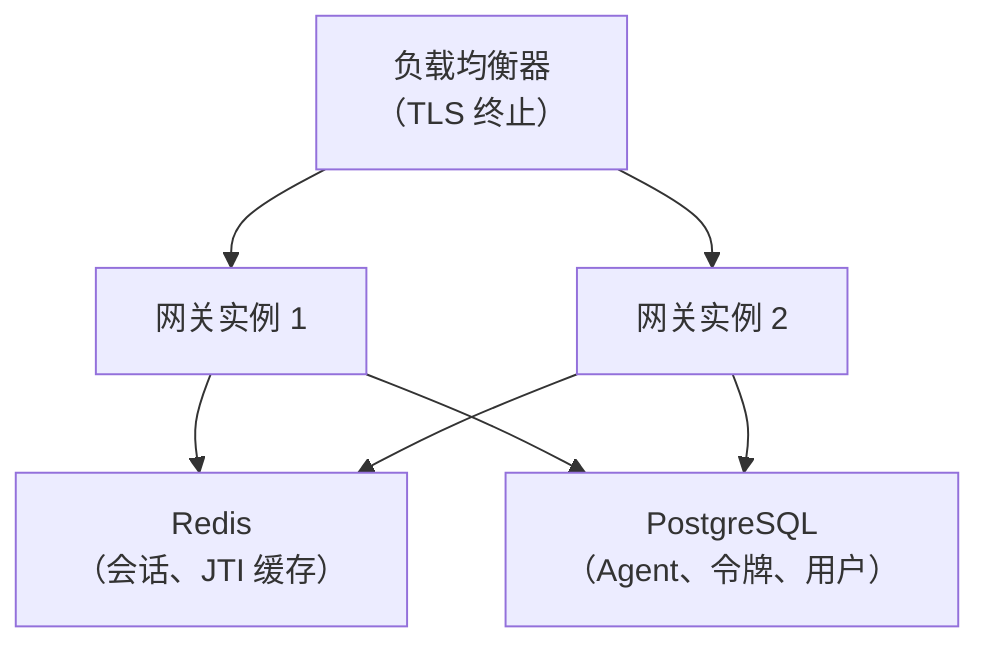

参考网关是一个**演示**。在用于生产之前，请处理以下事项：

## 必须做

| 事项 | 原因 | 操作方法 |
|------|------|---------|
| **启用认证验证** | 演示跳过了密码学验证 | 移除 `skipSignatureVerification: true` |
| **持久化存储** | 内存存储 = 重启后数据丢失 | 将 `InMemory*` 存储替换为 PostgreSQL/Redis |
| **TLS** | ATH 要求 HTTPS | 使用 nginx/Caddy 配置有效证书 |
| **强 JWT 密钥** | 演示使用启动时随机生成的密钥 | 将 `ATH_JWT_SECRET` 设为持久的强密钥 |
| **禁用注册** | 演示允许开放注册 | 设置 `ATH_SIGNUP_ENABLED=false`，手动管理用户 |

## 建议做

| 事项 | 原因 |
|------|------|
| **速率限制** | 防止对注册/令牌端点的暴力攻击 |
| **审计日志** | 追踪哪些 Agent 访问了什么、何时访问 |
| **提供商密钥加密** | 不要以明文 JSON 存储 OAuth 密钥 |
| **令牌过期调优** | 根据安全需求调整 `ATH_TOKEN_EXPIRY` |
| **健康检查** | 添加 `/health` 到你的监控 |

## 扩展架构

水平扩展的关键改动：所有实例必须通过外部存储共享会话和令牌状态。
