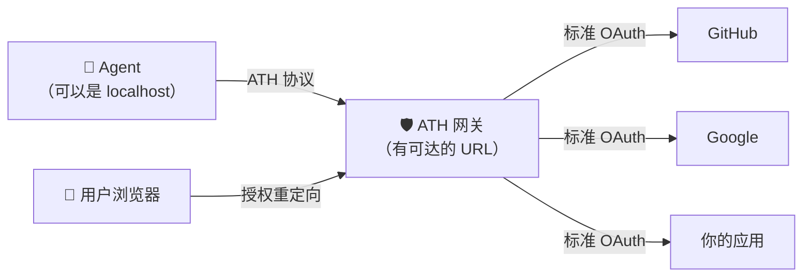
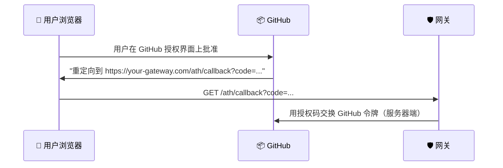
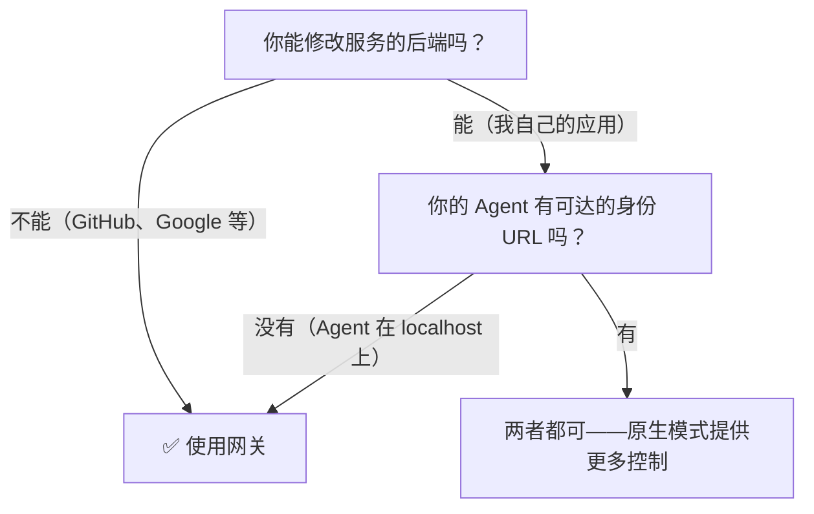
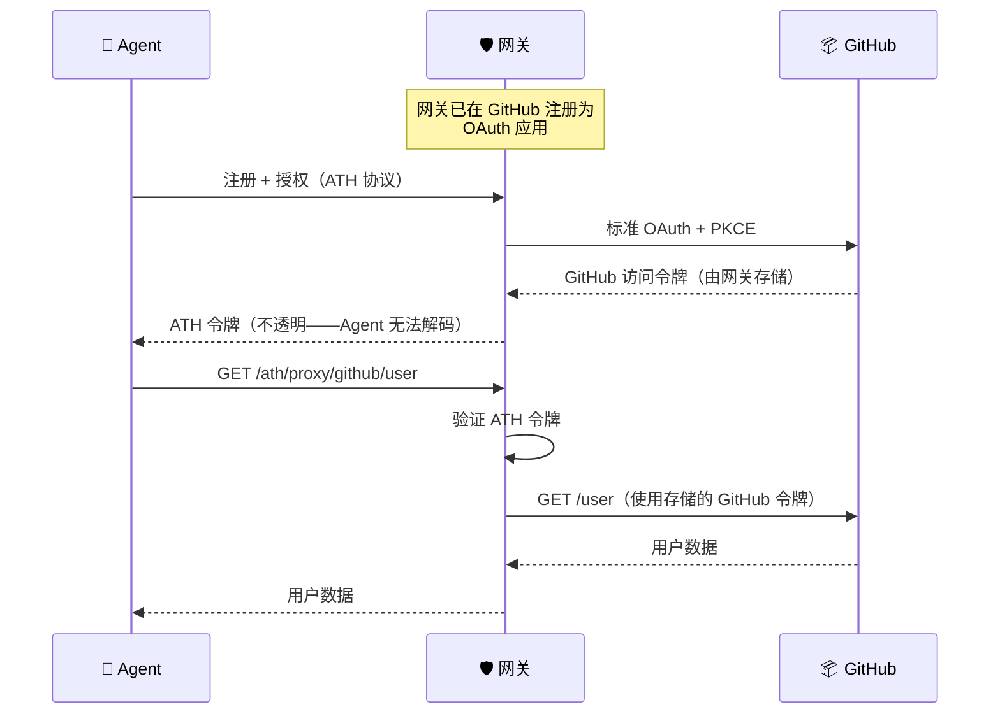

## 我们要构建什么

一个位于 Agent 和现有服务之间的网关。Agent 使用 ATH 协议与网关通信；网关使用标准 OAuth 与上游服务通信。**上游服务不需要任何改动。**



---

## 开始之前

### 你需要什么

| 需求 | 为什么需要 | 详情 |
|------|-----------|------|
| **网关的可达 URL** | 用户在（例如）GitHub 的授权界面批准后，GitHub 会将用户浏览器重定向到 `https://your-gateway.com/ath/callback`。GitHub 必须能到达这个 URL。 | 本地开发：如果你将 `http://localhost:4001` 注册为回调 URL，则它可以正常工作。生产环境：需要公网 URL。 |
| **每个提供商的 OAuth 凭据** | 网关充当每个提供商的 OAuth 客户端。你需要在提供商处注册一个"应用"，获取客户端 ID 和密钥。 | 在提供商的开发者控制台操作——例如 GitHub 的"OAuth Apps"设置。参见下方步骤 3。 |

<Accordion title="为什么网关需要可达？">
以下是用户授权过程中发生的事情：



用户在 GitHub 上点击"批准"后，**GitHub 告诉用户浏览器**跳转到回调 URL。如果浏览器无法到达该 URL，流程就会中断。

- **本地开发：** `http://localhost:4001` 可以正常工作，因为浏览器在同一台机器上
- **生产环境：** 网关需要一个用户浏览器可达的 URL（不需要 GitHub 服务器能直接访问——这是浏览器重定向，不是服务器间调用）
</Accordion>

### 你不需要什么

- ❌ 对上游服务的改动——这就是网关的意义
- ❌ Agent 的公网 URL——Agent 向外连接网关，无需接收入站连接
- ❌ Agent 的身份文档（开发环境中）——网关的 `skipAttestationVerification` 意味着网关不会尝试获取 Agent 的公钥
- ❌ 深入的 OAuth 或安全知识——每个提供商填 6 个字段，网关处理其余一切

### 何时使用网关（对比原生模式）



<Accordion title="为什么网关模式下 Agent 不需要公网 URL？">
在原生模式中，服务器从 `agent_id` URL 获取 Agent 的身份文档来验证公钥。这要求该 URL 从服务器可达。

在网关模式中使用 `skipAttestationVerification: true`（开发环境），网关完全不获取身份文档。在生产环境中，你可以通过网关的注册表配置信任特定 Agent——网关仍然验证 Agent 的认证 JWT，但你可以配置密钥解析而无需 Agent 托管公网 URL。

**底线：** 如果你在笔记本电脑上构建 Agent 且无法暴露公网 URL，网关模式是最简单的路径。
</Accordion>

---

## 步骤 1：运行网关

### 选项 A：从源码

```bash
git clone https://github.com/ath-protocol/gateway.git
cd gateway
git submodule update --init --recursive
npm install
ATH_SIGNUP_ENABLED=true npm run dev
```

### 选项 B：Docker

```bash
docker run -p 4001:3000 \
  -e ATH_SIGNUP_ENABLED=true \
  -e ATH_GATEWAY_HOST=http://localhost:4001 \
  ghcr.io/ath-protocol/gateway:latest
```

网关现在运行在 `http://localhost:4001`。

---

## 步骤 2：创建网关用户

网关支持多租户——每个用户有独立的 Agent 注册。创建一个管理员用户：

```bash
curl -X POST http://localhost:4001/auth/signup \
  -H "Content-Type: application/json" \
  -d '{"username":"admin","password":"your-secure-password"}'
```

保存响应中的 `token`——管理操作会用到它。

---

## 步骤 3：添加提供商

在网关目录中创建 `providers.json`，填入你的 OAuth 提供商详情：

```json
{
  "github": {
    "display_name": "GitHub",
    "available_scopes": ["read:user", "repo"],
    "authorize_endpoint": "https://github.com/login/oauth/authorize",
    "token_endpoint": "https://github.com/login/oauth/access_token",
    "api_base_url": "https://api.github.com",
    "client_id": "YOUR_GITHUB_CLIENT_ID",
    "client_secret": "YOUR_GITHUB_CLIENT_SECRET"
  }
}
```

<Accordion title="这 6 个字段从哪里来？">

| 字段 | 在哪里找 |
|------|---------|
| `display_name` | 你想怎么叫都行 |
| `available_scopes` | 提供商的文档（如 [GitHub scopes](https://docs.github.com/en/apps/oauth-apps/building-oauth-apps/scopes-for-oauth-apps)） |
| `authorize_endpoint` | 提供商的 OAuth 文档——用户被引导到此 URL 进行授权 |
| `token_endpoint` | 提供商的 OAuth 文档——授权码在此处交换令牌 |
| `api_base_url` | 提供商 API 的根 URL |
| `client_id` / `client_secret` | 在提供商处注册 OAuth 应用时创建 |
</Accordion>

<Accordion title="如何在 GitHub 注册 OAuth 应用？">
1. 前往 GitHub → **Settings → Developer settings → OAuth Apps → New OAuth App**
2. **Application name** 随意填写（如 "ATH Gateway"）
3. **Homepage URL** 设为你的网关 URL（如 `http://localhost:4001`）
4. **Authorization callback URL** 设为网关的回调地址：`http://localhost:4001/ath/callback`
   
   ⚠️ **必须完全匹配。** 用户在 GitHub 批准后，GitHub 告诉用户浏览器重定向到这个 URL。如果与网关发送的不匹配，GitHub 会拒绝重定向，你会看到"redirect_uri mismatch"错误。

5. 点击 **Register application**
6. 复制 **Client ID** 并点击 **Generate a client secret**
7. 将两个值填入你的 `providers.json`

同样的流程适用于任何 OAuth 提供商——注册应用，将回调 URL 设为 `https://your-gateway.com/ath/callback`，然后复制凭据。
</Accordion>

重启网关以加载新的提供商。

---

## 步骤 4：测试完整流程

```bash
# 发现可用的提供商
athx discover --gateway http://localhost:4001

# 注册 Agent
athx register --gateway http://localhost:4001 \
  --provider github --scopes "read:user,repo"

# 启动授权
athx authorize --gateway http://localhost:4001 \
  --provider github --scopes "read:user"
# → 在浏览器中打开 authorization_url
# → 登录 GitHub，点击"Authorize"

# 交换令牌（用户批准后）
athx token --gateway http://localhost:4001 \
  --code CODE_FROM_CALLBACK --session SESSION_ID

# 通过网关调用 GitHub API
athx proxy github GET /user --gateway http://localhost:4001
```

Agent 调用了 GitHub 的 API——但它**从未看到 GitHub 的 OAuth 令牌**。网关安全地持有令牌并用它转发请求。

---

## 工作原理



**关键安全特性：** 上游提供商令牌（GitHub 的 OAuth 令牌）**永远不会离开网关**。Agent 只持有网关发放的不透明 ATH 令牌。

---

## 用演示试试看

[ATH Demo](https://github.com/ath-protocol/demo) 包含预配置的网关设置。要在真实电商应用中查看网关模式运行：

```bash
git clone https://github.com/ath-protocol/demo.git
cd demo/demo/gateway
docker compose up --build
# 在另一个终端中：
docker compose up athx-demo
```

---

## 下一步

- [添加更多提供商](/zh/setup-gateway/add-providers) ——GitHub、Google、Slack 和自定义 OAuth 提供商
- [生产环境部署](/zh/setup-gateway/production) ——上线前需要更改的事项
