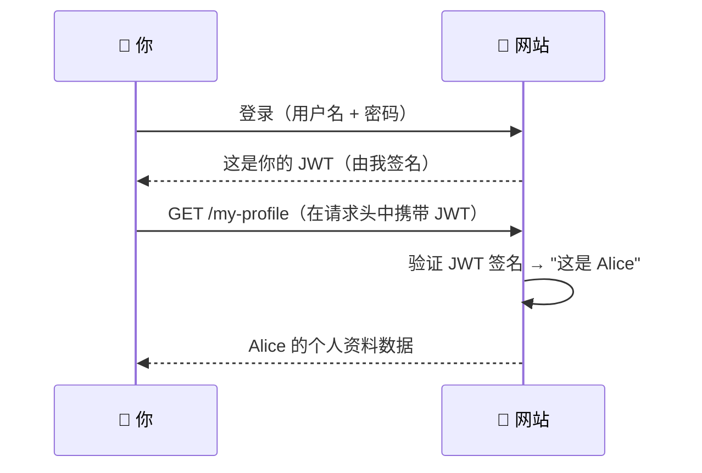
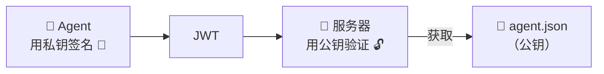
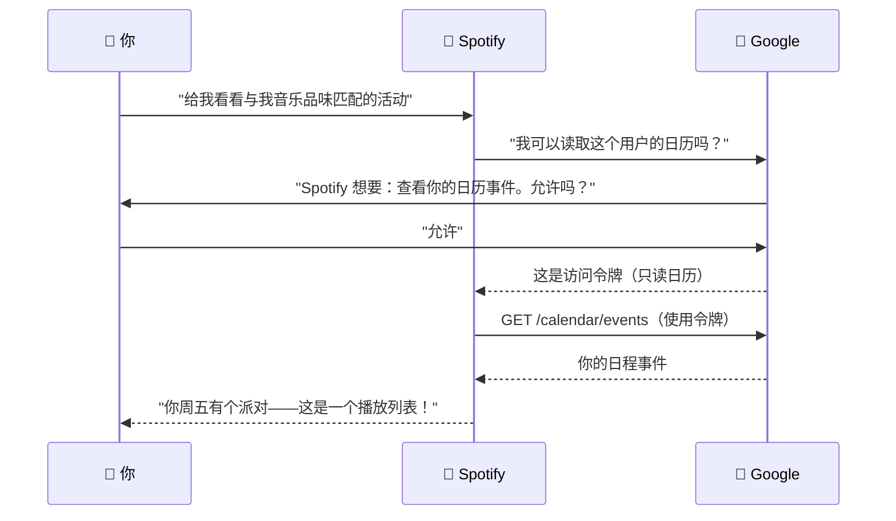
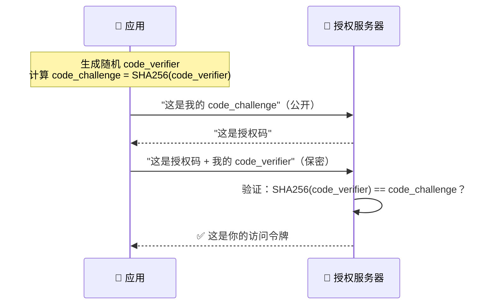
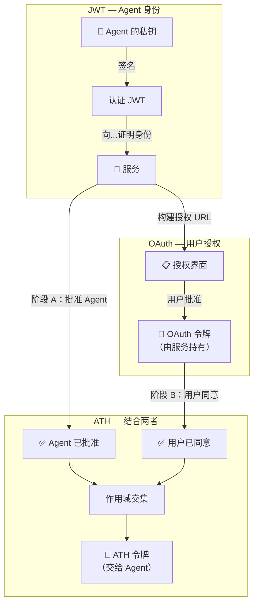

ATH 建立在两项广泛使用的技术之上：**JWT**（用于身份验证）和 **OAuth**（用于用户授权）。你不需要成为安全专家——本页用常见的例子来解释这两者。

---

## JWT：防篡改的身份证

### 它是什么

**JSON Web Token（JWT）** 是一个经过签名的小字符串，承载着声明——关于某人的事实。可以把它看作一张**无法伪造的数字身份证**。

```
eyJhbGciOiJFUzI1NiJ9.eyJzdWIiOiJhZ2VudC0xMjMifQ.MEUCIQDx...
└──── 头部 ────────────┘ └────── 载荷 ──────────────────┘ └ 签名 ┘
```

### 你已经在使用的真实案例

当你登录网站时，服务器通常会给你一个 JWT。你的浏览器在每次请求时都会发送它来证明"我是以 Alice 身份登录的。"



网站用它的密钥**签名**了 JWT。如果有人修改内容（例如把 "Alice" 改成 "Admin"），签名就不匹配，服务器会拒绝。

### ATH 如何使用 JWT

在 ATH 中，Agent 携带一个叫做**认证（attestation）**的 JWT，表示"我是 TravelBot，我可以证明。"服务器根据 Agent 公布的公钥验证签名。

```json
{
  "iss": "https://travelbot.example.com",
  "sub": "https://travelbot.example.com/.well-known/agent.json",
  "aud": "https://your-service.com",
  "exp": 1714503600,
  "jti": "unique-random-id"
}
```

| 字段 | 通俗解释 |
|------|---------|
| `iss` | "我由 travelbot.example.com 创建" |
| `sub` | "我的身份文档在这个 URL" |
| `aud` | "我正在与 your-service.com 通信" |
| `exp` | "此证明在此时间过期" |
| `jti` | "此证明从未被使用过" |

<Accordion title="对称与非对称——为什么 ATH 使用 ES256">
某些 JWT 使用**共享密钥**（对称）——创建者和验证者知道相同的密码。当双方是同一服务器时没问题（比如你的网站登录）。

ATH 使用 **ES256**（非对称）——Agent 有一个**私钥**（保密）并公布一个**公钥**（公开）。服务器使用公钥验证 JWT，而无需知道私钥。这意味着：

- Agent 可以向**任何**服务器证明身份
- 不需要提前交换共享密钥
- 服务器只需从 URL 获取公钥


</Accordion>

---

## OAuth："允许此应用访问我的数据"

### 它是什么

**OAuth 2.0** 是一个协议，就是你看到那些"使用 Google 登录"或"允许此应用访问你的日历？"界面的背后机制。它让用户**授予有限访问权限**，而无需分享密码。

### 真实案例：将 Spotify 连接到日历



关键点：
- **你从未把 Google 密码给 Spotify**
- Spotify 获得了**只读日历访问权限**，而非完整的 Google 账户访问
- 你可以随时在 Google 设置中**撤销** Spotify 的访问
- Google 发放了一个**限定范围的令牌** ——Spotify 无法用它读取你的邮件

### OAuth 中的四个角色

| 角色 | 在 Spotify 示例中 | 在 ATH 中 |
|-----|-------------------|----------|
| **资源所有者** | 你（日历是你的） | Agent 想访问其数据的用户 |
| **客户端** | Spotify（想要访问） | AI Agent |
| **授权服务器** | Google 的登录页面 | 你的应用的 OAuth 或网关的 OAuth |
| **资源服务器** | Google 日历 API | 你的应用的 API |

### PKCE：防止令牌盗窃

现代 OAuth 使用 **PKCE**（发音为 "pixie"）——一个额外的步骤，防止在重定向过程中有人窃取授权码。



即使攻击者窃取了授权码，没有 `code_verifier`（从未离开应用）也无法使用它。

**ATH 要求所有 OAuth 流程使用 PKCE。** SDK 会自动处理——你无需编写任何 PKCE 代码。

### 作用域：限制权限

**作用域**精确定义应用可以做什么：

| 作用域 | 含义 |
|-------|------|
| `calendar.readonly` | 读取日历事件（不能修改） |
| `products:read` | 浏览产品目录 |
| `cart:write` | 添加/移除购物车中的商品 |
| `orders:write` | 下订单 |
| `repo` | 完全访问代码仓库 |

用户在授权界面看到这些作用域，然后决定是否批准。

---

## 为什么仅有 OAuth 对 AI Agent 来说不够

OAuth 回答的问题是：**"用户是否同意？"**

但它无法回答：**"服务是否批准了这个 Agent？"**

| 场景 | 用户同意？ | 服务批准？ | OAuth 结果 | ATH 结果 |
|------|:-:|:-:|:---:|:---:|
| 已知 Agent，用户批准 | ✅ | ✅ | ✅ 允许访问 | ✅ 允许访问 |
| 未知 Agent 欺骗用户 | ✅ | ❌ | ✅ 允许访问 ⚠️ | ❌ 被阻止 |
| 已知 Agent，用户拒绝 | ❌ | ✅ | ❌ 无访问 | ❌ 无访问 |

**第 2 行就是问题所在。** 仅使用 OAuth，一个恶意 Agent 只要说服用户点击"允许"就能获得完全访问权限。服务从未有机会说"我不信任这个 Agent。"

ATH 添加了这个缺失的关卡。服务必须在用户看到授权界面**之前**批准 Agent。

---

## ATH 如何结合两者



- **JWT** 证明 Agent 是其声称的身份
- **OAuth** 获取用户的同意
- **ATH** 将两者绑定在一起：Agent 只有在服务批准且用户同意时才能获得令牌，且仅限于双方允许的**交集**范围

<Card title="下一步：运行演示 →" icon="play" href="/zh/start-here/run-the-demo">
  在真实电商应用中看到以上所有内容的实际运行
</Card>
