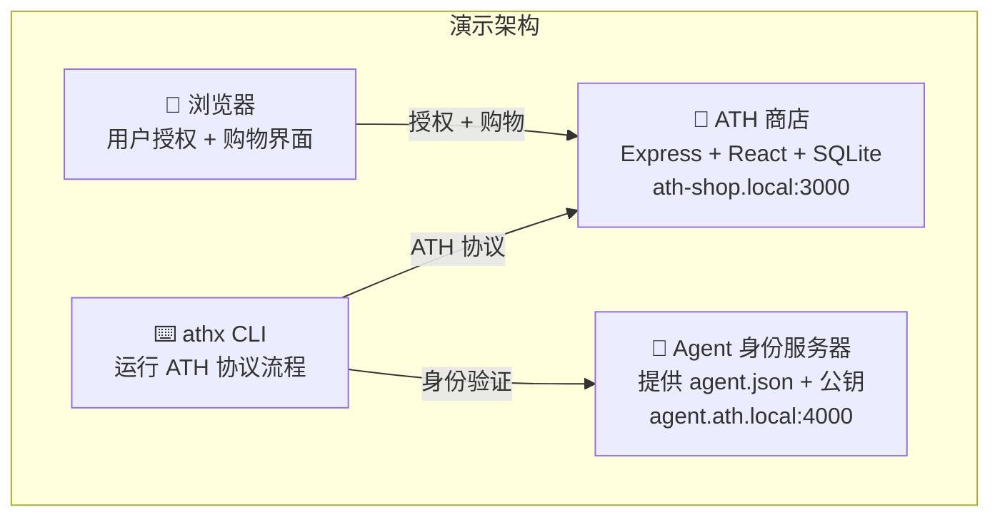

## 你将看到的内容

这个演示是一个**真实的电商商店**（ATH Shop），其中：
- 人类可以正常浏览商品、添加到购物车并结账
- AI Agent 也可以做同样的事情——**但只有在用户在浏览器中批准之后**



完成本页后，你将看到一个 AI Agent：
1. 发现商店的 ATH 端点
2. 向商店注册自身
3. 请求用户授权（用户在浏览器中看到授权页面）
4. 获取限定范围的访问令牌
5. 浏览商品、添加到购物车并下订单
6. 完成后撤销自己的访问权限

---

## 前提条件

- **Docker** 和 **Docker Compose** 已安装
- 一个终端

就这些。不需要 Node.js、Python，也不需要生成密钥。

---

## 步骤 1：克隆并启动

```bash
git clone https://github.com/ath-protocol/demo.git
cd demo
```

在你的 `/etc/hosts` 文件中添加以下条目：

```bash
# Mac/Linux 上：
echo "127.0.0.1 ath-shop.local agent.ath.local gateway.ath.local" | sudo tee -a /etc/hosts
```

以**原生模式**启动演示（Agent 直接连接商店）：

```bash
cd demo/native
docker compose up --build
```

等待输出：
```
ATH Shop HTTPS server running on https://ath-shop.local:3000
Agent identity server: https://agent.ath.local:4000
```

---

## 步骤 2：运行完整的 ATH 流程

在另一个终端中：

```bash
cd demo/native
docker compose up athx-demo
```

这将运行完整的 ATH 协议流程。观察输出——你会看到每个步骤的标签：

```
━━━ STEP 1: Service Discovery ━━━
━━━ STEP 2: Agent Registration (Phase A) ━━━
━━━ STEP 3: Request Authorization (Phase B) ━━━
━━━ STEP 4: User Consent in Browser (Interactive) ━━━
━━━ STEP 5: Token Exchange ━━━
━━━ STEP 6: Access E-Commerce API via ATH Token ━━━
━━━ STEP 7: Revoke Token ━━━
```

演示会打开浏览器，以测试用户身份登录，导航到授权页面，并点击"Authorize"——模拟真实用户的操作。

---

## 步骤 3：尝试网关模式

想通过网关看到相同的流程（无需修改商店）？

```bash
cd demo/gateway
docker compose up --build
# 在另一个终端中：
docker compose up athx-demo
```

在网关模式下，Agent 与 `gateway.ath.local:4001` 上的网关通信，网关再与商店通信。商店甚至不知道有 Agent 参与。

---

## 步骤 4：手动探索

在浏览器中打开 https://ath-shop.local:3000（接受自签名证书）。你将看到一个真实的电商界面，可以：
- 创建账户
- 浏览商品
- 添加商品到购物车
- 结账

这就是 Agent 交互的同一个应用——只是通过 ATH 保护的端点而非 Web 界面。

---

## 下一步

现在你已经看到了它的运行，让我们了解那 7 个步骤中**究竟发生了什么**：

<Card title="刚才发生了什么？ →" icon="magnifying-glass" href="/zh/start-here/what-just-happened">
  演示输出的逐行解析
</Card>
