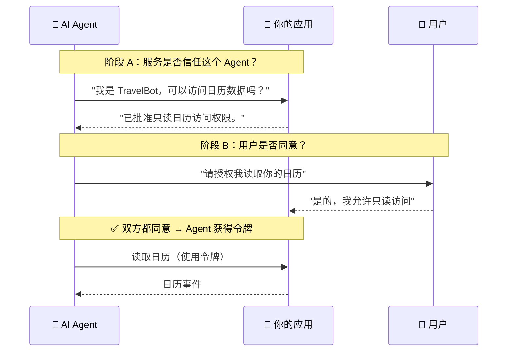

**ATH（Agent Trust Handshake，Agent 信任握手）** 是一个协议，允许 AI Agent 访问用户在外部服务上的数据——但**只有在服务和用户都同意之后**才行。它是 AI Agent 时代的 OAuth。

就是这样。两道关卡，都必须通过。Agent 获得的权限是被批准范围的**交集**——永远不会更多。

---

## 你是谁？

选择适合你情况的路径。每条路径都是一个独立的教程。

<Steps>
  <Step title="我有一个应用，希望 Agent 能安全地访问我的 API">
    你将在现有后端上添加 ATH 端点。大约需要 100 行代码。
    
    [前往：将 ATH 添加到你的应用 →](/zh/add-ath-to-your-app/tutorial)
  </Step>
  <Step title="我想在现有服务（GitHub、Google 等）前面添加信任层">
    你将部署一个网关。无需更改上游服务。
    
    [前往：设置网关 →](/zh/setup-gateway/tutorial)
  </Step>
  <Step title="我正在构建一个需要调用 ATH 保护 API 的 Agent">
    你将使用我们的 SDK（TypeScript/Python）或 CLI 工具。
    
    [前往：构建 Agent →](/zh/build-an-agent/tutorial)
  </Step>
</Steps>

---

## 在开始之前

在深入任何路径之前，我们建议做两件事：

1. **[了解 JWT 和 OAuth 基础](/zh/start-here/jwt-and-oauth-basics)** ——如果你还不熟悉，这篇 10 分钟的文章用真实例子解释了 ATH 所依赖的两项技术。

2. **[运行演示](/zh/start-here/run-the-demo)** ——5 分钟即可看到整个协议在真实电商应用中的运行效果。你会更快地理解一切。
