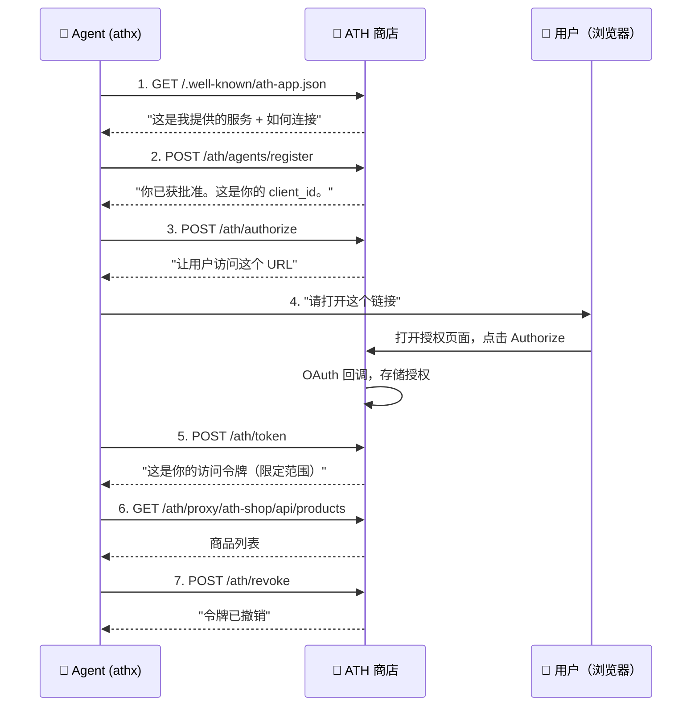

让我们追踪演示的执行过程。每个步骤都对应一个真实的 HTTP 调用。读完本页后，你将理解整个 ATH 协议。

## 完整流程



---

## 步骤 1：发现——"我可以连接到什么？"

```bash
GET https://ath-shop.local:3000/.well-known/ath-app.json
```

Agent 获取一个公开的 JSON 文档，内容是："这是我的名字，这是我支持的权限，这是认证方式。"

```json
{
  "ath_version": "0.1",
  "app_id": "com.ath-shop.ecommerce",
  "name": "ATH Shop E-Commerce API",
  "auth": {
    "type": "oauth2",
    "authorization_endpoint": "https://ath-shop.local:3000/oauth/authorize/redirect",
    "token_endpoint": "https://ath-shop.local:3000/oauth/token",
    "scopes_supported": ["products:read", "cart:read", "cart:write", "orders:read", "orders:write"]
  },
  "api_base": "https://ath-shop.local:3000/api"
}
```

<Accordion title="为什么需要这个？">
没有发现机制的话，每个 Agent 都需要手动配置你的应用 URL 和功能。`.well-known` 文档让你的应用能被任何兼容 ATH 的 Agent **自动发现**。
</Accordion>

---

## 步骤 2：注册——"我可以使用你的服务吗？"

```bash
POST https://ath-shop.local:3000/ath/agents/register
```

```json
{
  "agent_id": "https://agent.ath.local:4000/.well-known/agent.json",
  "agent_attestation": "eyJhbGciOiJFUzI1NiIs...",
  "requested_providers": [
    { "provider_id": "ath-shop", "scopes": ["products:read", "cart:write", "orders:write"] }
  ],
  "purpose": "AI Shopping Agent"
}
```

商店检查："我信任这个 Agent 吗？我愿意授予什么作用域？"

**响应：**
```json
{
  "client_id": "ath_abc123",
  "client_secret": "ath_secret_xyz",
  "agent_status": "approved",
  "approved_providers": [
    { "provider_id": "ath-shop", "approved_scopes": ["products:read", "cart:write", "orders:write"] }
  ]
}
```

<Accordion title="agent_attestation 是什么？">
它是一个签名的 JWT，证明 Agent 是其声称的身份。Agent 有一个私钥；其公钥发布在 `agent_id` URL 上。商店可以验证签名。

可以把它想象成一张身份证——Agent 出示身份证，商店可以验证它不是伪造的。你不需要理解密码学就能实现这一点——SDK 会自动处理签名。
</Accordion>

---

## 步骤 3：授权——"让我询问用户"

```bash
POST https://ath-shop.local:3000/ath/authorize
```

```json
{
  "client_id": "ath_abc123",
  "agent_attestation": "eyJhbGciOiJFUzI1NiIs...",
  "provider_id": "ath-shop",
  "scopes": ["products:read", "cart:write", "orders:write"],
  "state": "random-csrf-token"
}
```

**响应：**
```json
{
  "authorization_url": "https://ath-shop.local:3000/oauth/authorize?client_id=...&scope=...&code_challenge=...",
  "ath_session_id": "ath_sess_def456"
}
```

Agent 得到一个 URL 让用户访问。这是一个标准的 OAuth 授权页面。

---

## 步骤 4：用户授权——"用户做出决定"

用户在浏览器中打开 `authorization_url` 并看到：

> **ATH Shop 演示 Agent** 想要访问你的账户：
> - ✅ 查看商品
> - ✅ 管理购物车
> - ✅ 下订单
>
> [授权] [拒绝]

如果用户点击**授权**，商店会在内部处理 OAuth 回调。用户**永远不会**把密码给 Agent。

<Accordion title="技术层面发生了什么？">
URL 中包含 PKCE 代码挑战。当用户批准时，商店的 OAuth 服务器发放授权码，将其交换为内部令牌，并在 ATH 会话上存储用户同意的作用域。这一切都在服务器端处理——Agent 看不到任何内容。
</Accordion>

---

## 步骤 5：令牌交换——"这是你的限定范围访问权限"

```bash
POST https://ath-shop.local:3000/ath/token
```

```json
{
  "grant_type": "authorization_code",
  "client_id": "ath_abc123",
  "client_secret": "ath_secret_xyz",
  "agent_attestation": "eyJhbGciOiJFUzI1NiIs...",
  "code": "exchange",
  "ath_session_id": "ath_sess_def456"
}
```

**响应：**
```json
{
  "access_token": "ath_tk_secure_token",
  "expires_in": 3600,
  "effective_scopes": ["products:read", "cart:write", "orders:write"],
  "scope_intersection": {
    "agent_approved": ["products:read", "cart:write", "orders:write"],
    "user_consented": ["products:read", "cart:write", "orders:write"],
    "effective": ["products:read", "cart:write", "orders:write"]
  }
}
```

**作用域交集**是核心创新：Agent 只获得**三方**都同意的作用域：
- 商店为此 Agent 批准的范围（**阶段 A**）
- 用户同意的范围（**阶段 B**）
- Agent 实际请求的范围（**本次调用**）

如果三者中任一方不包含某个作用域，Agent 就无法获得它。

---

## 步骤 6：使用 API——"现在我可以购物了"

```bash
GET https://ath-shop.local:3000/ath/proxy/ath-shop/api/products
Authorization: Bearer ath_tk_secure_token
```

Agent 通过 ATH 代理转发调用商店的 API。代理转发层会：
1. 验证令牌（未过期、未撤销）
2. 检查请求是否在授权作用域内
3. 转发到真实 API

Agent 现在可以浏览商品、添加到购物车并下订单——就像用户通过 Web 界面一样。

---

## 步骤 7：撤销——"我完成了"

```bash
POST https://ath-shop.local:3000/ath/revoke
{ "client_id": "ath_abc123", "client_secret": "ath_secret_xyz", "token": "ath_tk_secure_token" }
```

Agent 完成后自行清理。令牌现在已失效。

---

## 核心要点

整个协议存在是为了回答**两个问题**：

| 问题 | 谁来回答 | 何时 |
|------|:------:|------|
| "这个 Agent 是否应该被允许访问？" | 🏢 你的应用（服务） | 步骤 2（注册） |
| "这个特定用户是否希望这个 Agent 代表自己行事？" | 👤 用户 | 步骤 4（授权） |

OAuth 单独只能回答第二个问题。ATH 添加了第一个。

---

## 你想构建什么？

<CardGroup cols={3}>
  <Card title="将 ATH 添加到我的应用" icon="server" href="/zh/add-ath-to-your-app/tutorial">
    我想保护我的 API，让 Agent 可以安全地访问它
  </Card>
  <Card title="设置网关" icon="shield-halved" href="/zh/setup-gateway/tutorial">
    我想在现有服务前面添加 ATH
  </Card>
  <Card title="构建 Agent" icon="robot" href="/zh/build-an-agent/tutorial">
    我想让我的 Agent 调用 ATH 保护的 API
  </Card>
</CardGroup>
